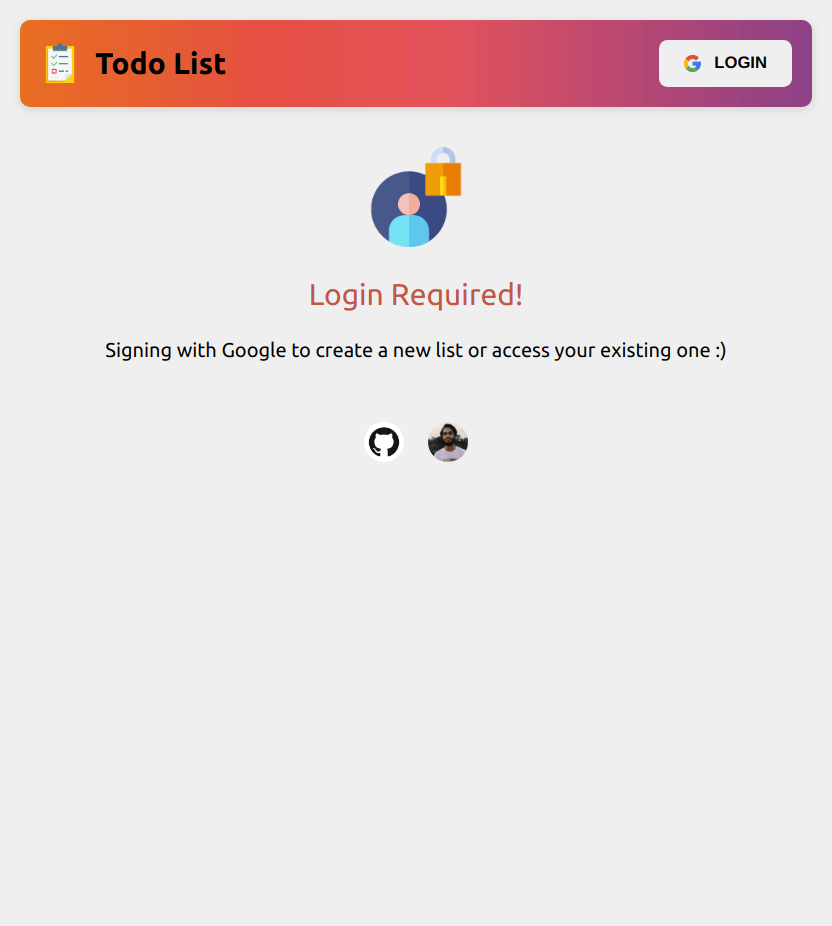
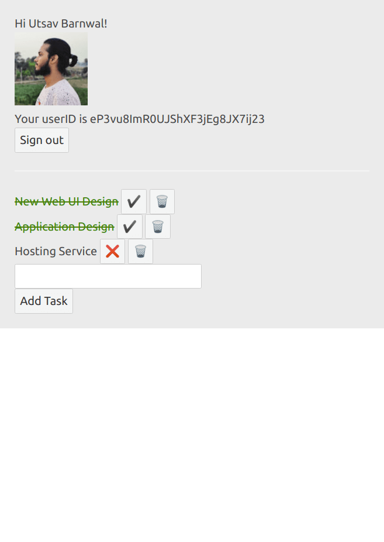

# TodoList Svelte
Simple todo list web application built with SvelteJS and Firestore and Google Authentication.

## Samples
Following images are linked to their full size

<a href="./samples/landing.png">
  
</a>

<a href="./samples/list.png">
  
</a>

## Get started

Install the dependencies

```bash
yarn install
```

Run the dev build

```bash
yarn dev
```

Navigate to [localhost:5000](http://localhost:5000). 
